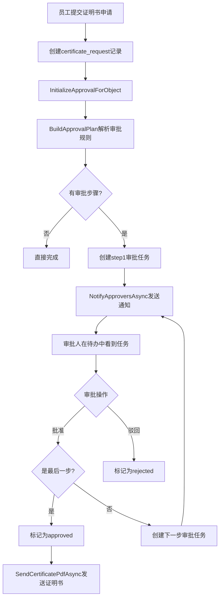

# 证明书申请/审批功能 Review 报告

## 1. 概述

本报告对证明书申请（certificate_request）和通用审批流功能进行代码Review，识别bug和改善点。

### 涉及代码范围

| 层级 | 文件 | 功能 |
|-----|-----|-----|
| 前端 | `web/src/views/CertificateRequestForm.vue` | 证明书申请表单 |
| 前端 | `web/src/views/CertificateRequestsList.vue` | 证明书申请列表 |
| 前端 | `web/src/views/ApprovalsInbox.vue` | 审批待办 |
| 前端 | `web/src/views/ApprovalsDesigner.vue` | 审批规则设计器 |
| 后端 | `server-dotnet/Program.cs` | 审批API和DSL引擎 |

---

## 2. 审批流程图



---

## 3. Bug清单

### 3.1 严重级别 (P0)

| # | 位置 | 问题描述 | 影响 |
|---|-----|---------|-----|
| B01 | `Program.cs:5280` | `/operations/certificate_request/{id}/pdf` POST接口使用`.AllowAnonymous()`，任何人可触发PDF生成 | 安全漏洞 |
| B02 | `CertificateRequestForm.vue` | 表单没有提交`employeeId`字段，但后端依赖此字段获取员工信息 | PDF生成时员工信息为空 |

### 3.2 高级别 (P1)

| # | 位置 | 问题描述 | 影响 |
|---|-----|---------|-----|
| B03 | `Program.cs:4930` | `deptManagerOf`解析器查询`u.dept_id`字段，需确认users表是否有此字段 | 部门经理审批可能失效 |
| B04 | `ApprovalsDesigner.vue` | 缺少AI编译按钮，`compile`函数存在但未绑定到UI | 无法使用AI生成审批规则 |
| B05 | `Program.cs:4768-4771` | 规则存储位置不一致：设计器保存到`ui.approval`，但引擎先从`schema.approval`读取 | 规则可能不生效 |

### 3.3 中级别 (P2)

| # | 位置 | 问题描述 | 影响 |
|---|-----|---------|-----|
| B06 | `ApprovalsInbox.vue` | 待办列表未显示申请详情（类型、申请人等） | 审批人无法快速了解内容 |
| B07 | `CertificateRequestsList.vue` | 列表未显示审批状态和当前步骤 | 申请人无法跟踪进度 |
| B08 | `Program.cs:4977` | 邮件发送失败时静默忽略，无日志记录 | 通知丢失难以排查 |

---

## 4. 改善建议清单

### 4.1 前端改善

| # | 页面 | 改善内容 | 优先级 |
|---|-----|---------|-------|
| I01 | CertificateRequestForm | 自动获取当前登录用户的员工信息并提交`employeeId` | 高 |
| I02 | CertificateRequestForm | 提交成功后自动跳转到列表页或显示审批流程预览 | 中 |
| I03 | CertificateRequestForm | 添加"代为申请"功能（HR可选择其他员工） | 低 |
| I04 | CertificateRequestsList | 添加状态列（pending/approved/rejected） | 高 |
| I05 | CertificateRequestsList | 添加"撤回申请"和"重新提交"操作按钮 | 中 |
| I06 | ApprovalsInbox | 显示申请摘要（类型、申请人名字） | 高 |
| I07 | ApprovalsInbox | 添加查看详情功能（弹窗或跳转） | 中 |
| I08 | ApprovalsInbox | 添加批量审批功能 | 低 |
| I09 | ApprovalsInbox | 添加"我的申请"视图切换 | 中 |
| I10 | ApprovalsDesigner | 添加AI编译按钮调用`compile`函数 | 高 |
| I11 | ApprovalsDesigner | 支持选择更多实体类型（不仅限certificate_request） | 中 |
| I12 | ApprovalsDesigner | 添加JSON格式验证和规则测试功能 | 中 |

### 4.2 后端改善

| # | 模块 | 改善内容 | 优先级 |
|---|-----|---------|-------|
| I13 | 审批引擎 | 添加审批历史表记录完整审计日志（谁/何时/操作/备注） | 高 |
| I14 | 通知服务 | 邮件发送失败时记录日志，支持重试机制 | 中 |
| I15 | PDF生成 | POST接口添加认证要求，移除AllowAnonymous | 高 |
| I16 | 审批规则 | 统一规则存储位置，优先使用`ui.approval.rules` | 高 |
| I17 | 审批引擎 | overrides支持插入位置（不仅是append） | 低 |
| I18 | 员工信息 | 申请创建时自动从JWT获取employeeId并保存 | 高 |

---

## 5. 二级审批测试要点

### 5.1 测试场景

```
场景1: 基本二级审批
- 配置: steps = [{name:"部门经理审批", who:[{by:"role",roleCode:"MANAGER"}]}, {name:"HR审批", who:[{by:"role",roleCode:"HR"}]}]
- 预期: 第一步MANAGER批准后，自动创建第二步HR的审批任务

场景2: 条件追加审批
- 配置: overrides = [{when:{json:"type",eq:"退职证明"}, append:[{name:"财务审批",who:[{by:"role",roleCode:"FINANCE"}]}]}]
- 预期: 当type="退职证明"时，在基础步骤后追加财务审批

场景3: 多人审批(pick:all)
- 配置: assignRules = {pick:"all"}
- 预期: 同一步骤多个审批人都批准后才进入下一步
```

### 5.2 验证步骤

1. 在`ApprovalsDesigner`配置包含2个steps的规则
2. 提交证明书申请
3. 验证第一个审批人能看到待办
4. 第一个审批人批准
5. **验证第二个审批人能看到待办（重点）**
6. 第二个审批人批准
7. 验证申请状态变为approved，PDF已发送

---

## 6. 代码修复示例

### 6.1 修复B01: PDF接口安全问题

```csharp
// Program.cs 第5280行
// 修改前
}).AllowAnonymous();

// 修改后
}).RequireAuthorization();
```

### 6.2 修复B02: 前端提交employeeId

```vue
// CertificateRequestForm.vue - 在submit函数中添加
async function submit(){
  // ... 省略前面代码
  const userInfo = await api.get('/auth/me')  // 获取当前用户信息
  const payload = { 
    type: form.type, 
    language: form.language, 
    purpose: form.purpose, 
    toEmail: form.toEmail, 
    resignReason: form.resignReason,
    employeeId: userInfo.data?.employeeCode || ''  // 添加员工ID
  }
  // ... 
}
```

### 6.3 修复B04: 添加AI编译按钮

```vue
// ApprovalsDesigner.vue 模板中添加
<el-form-item>
  <el-button :loading="compiling" @click="compile">AI编译规则</el-button>
</el-form-item>
```

### 6.4 修复B05: 统一规则读取位置

```csharp
// Program.cs BuildApprovalPlan函数中修改
// 优先从 ui.approval.rules 读取，兼容旧版 schema.approval
if (root.TryGetProperty("ui", out var uiEl) && uiEl.TryGetProperty("approval", out var uiAp))
{
    if (uiAp.TryGetProperty("rules", out var rulesEl)) ap = rulesEl;
}
if (ap.ValueKind == JsonValueKind.Undefined && root.TryGetProperty("schema", out var schemaEl))
{
    if (schemaEl.TryGetProperty("approval", out var ap2)) ap = ap2;
}
// ... 保留原有兼容逻辑
```

---

## 7. 总结

| 类别 | 数量 |
|-----|-----|
| P0 Bug | 2 |
| P1 Bug | 3 |
| P2 Bug | 3 |
| 改善建议 | 18 |

**建议优先处理顺序：**
1. B01, B02 - 安全和核心功能问题
2. B05, I16 - 审批规则存储一致性
3. I01, I18 - 员工ID自动获取
4. B04, I10 - AI编译功能完善
5. I04, I06 - 列表信息展示优化

