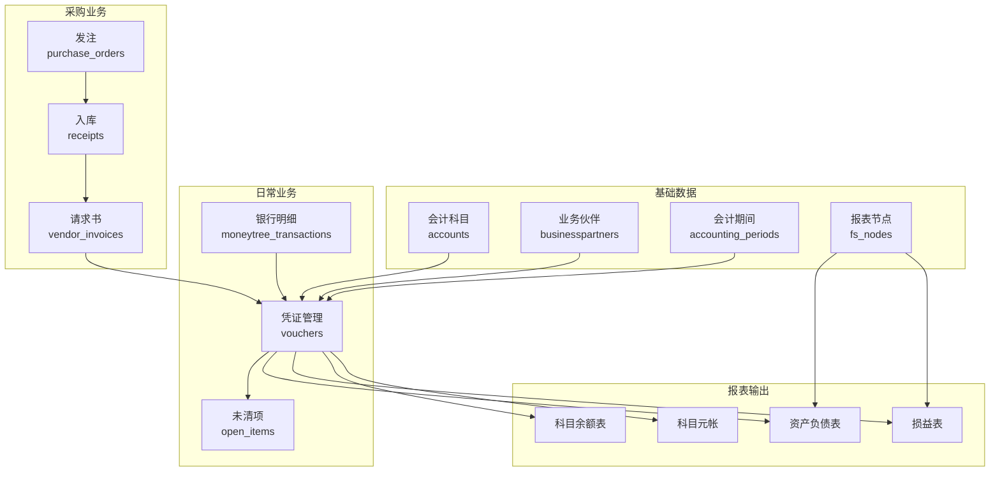
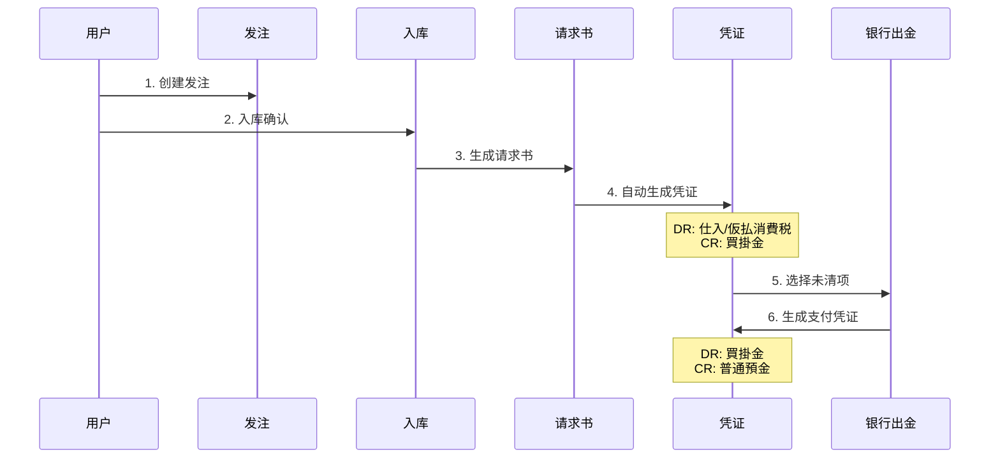
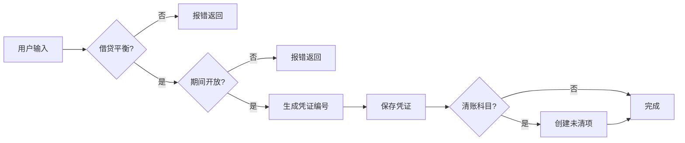
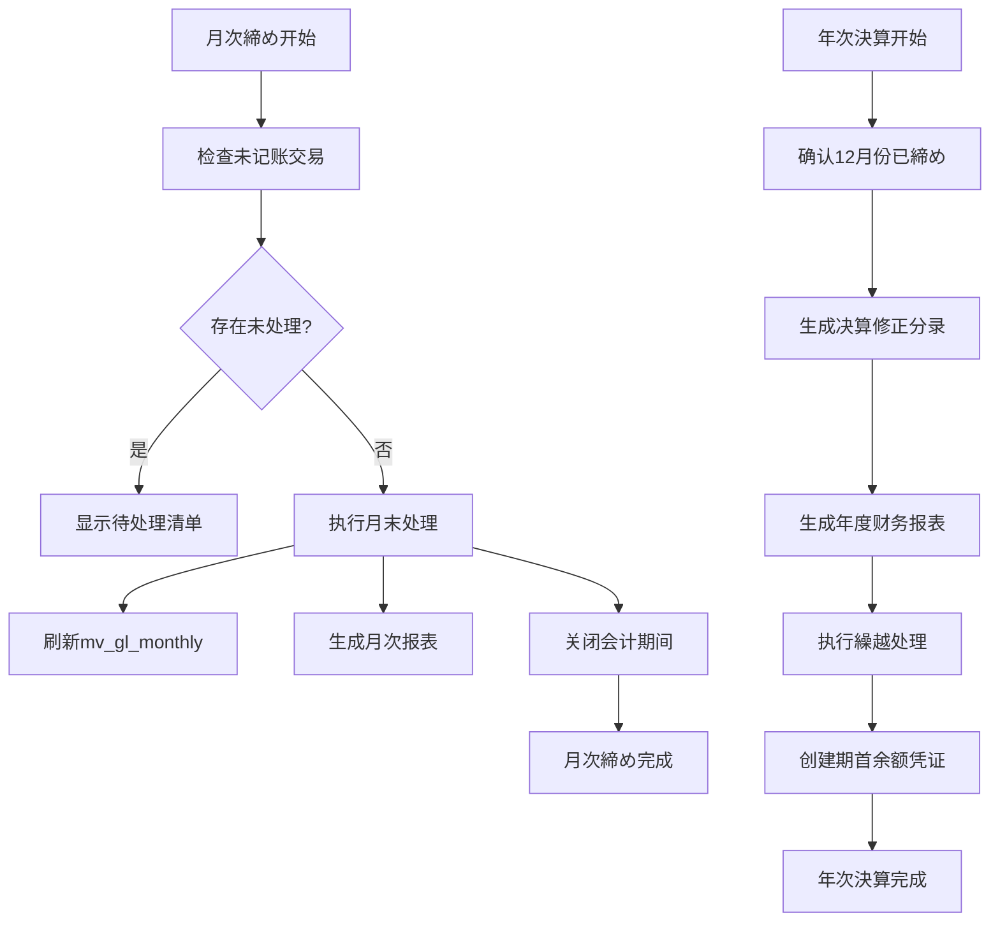
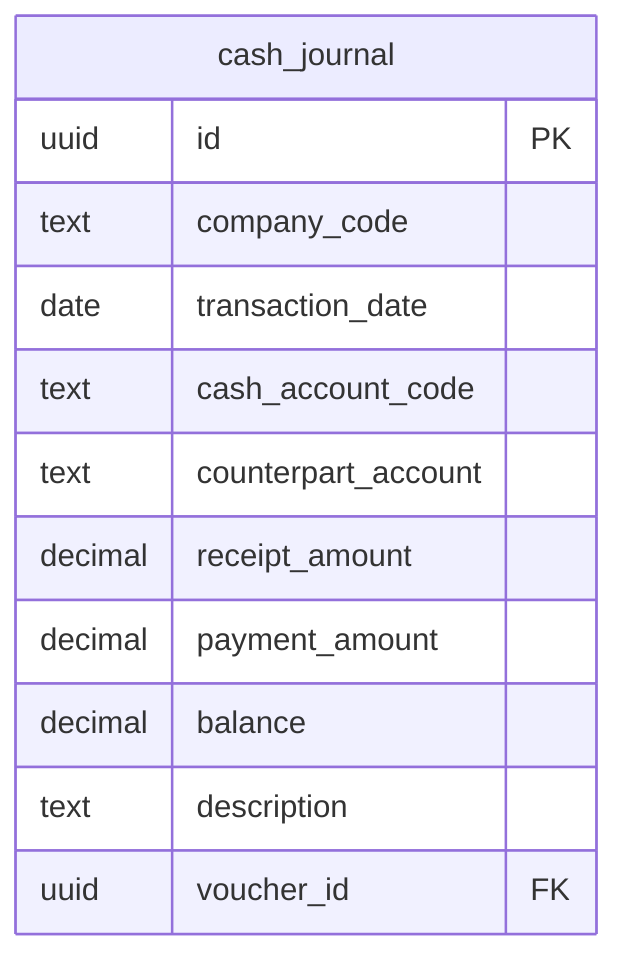

# 财务会计模块功能分析报告

本文档对系统的财务会计模块进行全面分析，评估其对日本中小企业的适配程度，并提出改进建议。

---

## 1. 功能概览

### 1.1 已实现功能一览

| 分类 | 功能 | 状态 | 说明 |
|-----|------|:----:|-----|
| **科目管理** | 科目表CRUD | ✅ | 支持BS/PL分类、未清项标记 |
| | 科目字段规则 | ✅ | 按科目控制辅助核算字段必填/隐藏 |
| | 科目别名 | ✅ | 支持多个别名便于AI识别 |
| | 财务报表分组 | ✅ | fsBalanceGroup/fsProfitGroup |
| | 银行/现金科目 | ✅ | 支持bankInfo配置 |
| **凭证管理** | 凭证创建 | ✅ | 借贷平衡检查、自动编号 |
| | 凭证编辑/删除 | ✅ | 期间检查、清账检查 |
| | 税行自动展开 | ✅ | 从line.tax自动生成仮払/仮受消費税行 |
| | 附件上传 | ✅ | Azure Blob存储 |
| | AI辅助记账 | ✅ | 图片识别、规则匹配 |
| **会计期间** | 期间开闭管理 | ✅ | 控制凭证创建/修改/删除 |
| | 期间检查 | ✅ | 关闭期间仅允许文本修改 |
| **未清项管理** | 自动生成未清项 | ✅ | 清账科目自动创建open_items |
| | 清账处理 | ✅ | 银行入金/出金配分 |
| | 残高追踪 | ✅ | residual_amount管理 |
| **银行业务** | 银行入金配分 | ✅ | 应收账款清账 |
| | 银行出金配分 | ✅ | 应付账款清账 |
| | 银行明细导入 | ✅ | MoneyTree API对接 |
| | 自动记账规则 | ✅ | 基于描述的规则匹配 |
| **财务报表** | 资产负债表 | ✅ | 按期间汇总 |
| | 损益表 | ✅ | 按期间范围汇总 |
| | 报表节点定义 | ✅ | 支持层级结构 |
| | 月度汇总视图 | ✅ | mv_gl_monthly物化视图 |
| **科目余额** | 科目余额查询 | ✅ | 按年度月别发生额 |
| | 科目元帐 | ✅ | 单科目明细查询 |
| **供应商请求书** | 三单匹配 | ✅ | 发注→入库→请求书 |
| | 自动记账 | ✅ | 仕入/買掛金/仮払消費税 |
| **发票登记** | 登记号验证 | ✅ | 调用国税厅API |
| | 登记信息显示 | ✅ | 名称、有效期间 |

### 1.2 功能架构图



---

## 2. 数据库核心表结构

### 2.1 会计凭证表 (vouchers)

| 字段 | 类型 | 说明 |
|-----|------|-----|
| id | UUID | 主键 |
| company_code | TEXT | 公司代码 |
| payload | JSONB | 凭证内容（header+lines） |
| posting_date | DATE | 转记日（生成列） |
| voucher_type | TEXT | 凭证类型（生成列） |
| voucher_no | TEXT | 凭证编号（生成列） |

**payload.header 结构：**
```json
{
  "companyCode": "JP01",
  "postingDate": "2025-01-15",
  "voucherType": "GL",
  "voucherNo": "2501000001",
  "currency": "JPY",
  "summary": "摘要"
}
```

**payload.lines 结构：**
```json
[
  {
    "lineNo": 1,
    "accountCode": "1000",
    "drcr": "DR",
    "amount": 10000,
    "vendorId": "BP001",
    "note": "备注"
  }
]
```

### 2.2 会计科目表 (accounts)

| 字段 | 类型 | 说明 |
|-----|------|-----|
| account_code | TEXT | 科目代码（生成列） |
| name | TEXT | 科目名称（生成列） |
| pl_bs_type | TEXT | BS/PL分类（生成列） |
| open_item_mgmt | BOOLEAN | 是否清账科目（生成列） |
| fs_bs_group | TEXT | 资产负债表分组（生成列） |
| fs_pl_group | TEXT | 损益表分组（生成列） |

### 2.3 未清项表 (open_items)

| 字段 | 类型 | 说明 |
|-----|------|-----|
| voucher_id | UUID | 来源凭证ID |
| account_code | TEXT | 科目代码 |
| partner_id | TEXT | 业务伙伴ID |
| original_amount | NUMERIC | 原始金额 |
| residual_amount | NUMERIC | 残余金额 |
| cleared_flag | BOOLEAN | 是否已清账 |

---

## 3. 业务流程

### 3.1 采购到付款流程



### 3.2 凭证记账流程



---

## 4. 日本中小企业适配度评估

### 4.1 适配良好的领域 ✅

| 领域 | 评估 | 说明 |
|-----|:----:|-----|
| 复式记账 | ⭐⭐⭐⭐⭐ | 标准的借贷记账，支持多行明细 |
| 消费税处理 | ⭐⭐⭐⭐ | 自动拆分仮払/仮受消費税 |
| 发票制度(インボイス) | ⭐⭐⭐⭐⭐ | 支持登录番号验证 |
| 科目体系 | ⭐⭐⭐⭐ | 支持日本标准科目 |
| 财务报表 | ⭐⭐⭐⭐ | BS/PL报表基本完整 |
| 银行连携 | ⭐⭐⭐⭐ | MoneyTree API集成 |

### 4.2 需要补充的功能 ⚠️

| 功能 | 重要度 | 现状 | 建议 |
|-----|:-----:|-----|-----|
| **月次决算** | 高 | 无专门流程 | 添加月次締め/解除功能 |
| **年次决算** | 高 | 无 | 添加年度繰越处理 |
| **消费税申报** | 高 | 无 | 添加消费税计算/申告书生成 |
| **源泉税处理** | 中 | 部分（工资） | 扩展到支付手数料等 |
| **固定资产管理** | 中 | 有基础功能 | 完善折旧计算、偿却奉行 |
| **现金出纳帐** | 中 | 无专门功能 | 添加小口现金管理 |
| **仕訳帳** | 中 | 无标准格式 | 添加日本标准仕訳帳导出 |
| **総勘定元帳** | 中 | 有基础 | 添加标准格式导出 |
| **試算表** | 中 | 无 | 添加合计試算表/残高試算表 |
| **振替伝票** | 低 | 通过凭证实现 | 添加专门的振替伝票格式 |
| **電子帳簿保存法** | 低 | 部分 | 添加检索/保存要件支持 |

---

## 5. 缺失功能详细说明及补充方案

### 5.1 月次决算・年次决算

**现状问题：**
- 会计期间表存在但缺少标准的月次締め流程
- 无年度繰越处理功能

**补充方案：**



**需要添加的API：**
- `POST /operations/monthly-close` - 月次締め
- `POST /operations/monthly-reopen` - 月次締め解除
- `POST /operations/yearly-close` - 年次決算
- `POST /operations/carry-forward` - 繰越処理

### 5.2 消费税申报

**现状问题：**
- 虽然支持消费税拆分记账，但缺少申报计算功能

**补充方案：**

| 功能 | 说明 |
|-----|-----|
| 课税売上集计 | 按税率(10%/8%)汇总销售额 |
| 課税仕入集计 | 按税率汇总采购额 |
| 消费税计算 | 売上消费税 - 仕入消费税 |
| 申告书生成 | 生成消费税申告书PDF |
| 中间申告 | 支持季度中间申报 |

**数据模型扩展：**
```sql
CREATE TABLE consumption_tax_returns (
  id UUID PRIMARY KEY,
  company_code TEXT NOT NULL,
  period_from DATE NOT NULL,
  period_to DATE NOT NULL,
  taxable_sales_10 NUMERIC(18,2),
  taxable_sales_8 NUMERIC(18,2),
  tax_on_sales NUMERIC(18,2),
  tax_on_purchases NUMERIC(18,2),
  tax_payable NUMERIC(18,2),
  status TEXT DEFAULT 'draft',
  submitted_at TIMESTAMPTZ,
  payload JSONB
);
```

### 5.3 試算表（合计残高試算表）

**补充方案：**

```
┌──────────────────────────────────────────────────────────────────┐
│                    合計残高試算表                                  │
│                    2025年1月1日～2025年12月31日                    │
├────────┬──────────────────┬──────────────┬──────────────────────┤
│ 科目   │ 科目名称          │  借方残高    │   貸方残高           │
├────────┼──────────────────┼──────────────┼──────────────────────┤
│ 1000   │ 現金              │  1,234,567   │                      │
│ 1100   │ 普通預金          │ 12,345,678   │                      │
│ 1200   │ 売掛金            │  5,678,901   │                      │
│ 2100   │ 買掛金            │              │       3,456,789      │
│ ...    │ ...               │              │                      │
├────────┴──────────────────┼──────────────┼──────────────────────┤
│                    合計   │ 50,000,000   │      50,000,000      │
└───────────────────────────┴──────────────┴──────────────────────┘
```

**需要添加的API：**
- `GET /reports/trial-balance` - 試算表

### 5.4 現金出納帳

**补充方案：**



---

## 6. 功能优先级建议

### 6.1 短期（1-2个月）

| 优先级 | 功能 | 工作量估计 |
|:-----:|-----|:---------:|
| P0 | 月次締め/解除 | 3天 |
| P0 | 試算表报表 | 2天 |
| P1 | 仕訳帳标准格式导出 | 2天 |
| P1 | 総勘定元帳标准格式导出 | 2天 |

### 6.2 中期（3-6个月）

| 优先级 | 功能 | 工作量估计 |
|:-----:|-----|:---------:|
| P1 | 年次決算/繰越処理 | 5天 |
| P1 | 消费税申报功能 | 7天 |
| P2 | 現金出納帳 | 3天 |
| P2 | 固定资产折旧自动化 | 5天 |

### 6.3 长期（6个月以上）

| 优先级 | 功能 | 工作量估计 |
|:-----:|-----|:---------:|
| P2 | 電子帳簿保存法对应 | 10天 |
| P3 | 多通貨対応强化 | 7天 |
| P3 | 连结决算支持 | 15天 |

---

## 7. 总结

### 7.1 适配度评分

| 评估维度 | 得分 | 说明 |
|---------|:----:|-----|
| 日常记账 | 90% | 基本满足需求 |
| 消费税处理 | 80% | 记账OK，申报待补充 |
| 期间管理 | 70% | 月次/年次流程需完善 |
| 财务报表 | 75% | BS/PL有，試算表待补充 |
| 法规遵从 | 65% | 電子帳簿保存法待对应 |
| **综合评分** | **76%** | 基本可用，需持续完善 |

### 7.2 结论

当前财务会计模块已具备中小企业日常记账和报表的核心功能，特别是：
- ✅ 发票制度(インボイス)支持良好
- ✅ 消费税拆分记账完善
- ✅ 银行连携功能实用

但对于正式的会计决算和税务申报，建议优先补充：
1. **月次締め流程** - 确保数据完整性
2. **試算表** - 基本的会计检查工具
3. **年次決算** - 年度结账和繰越处理

这些功能的补充将使系统达到中小企业会计软件的标准水平。

