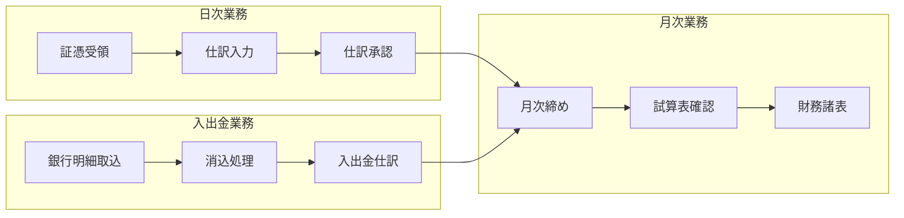
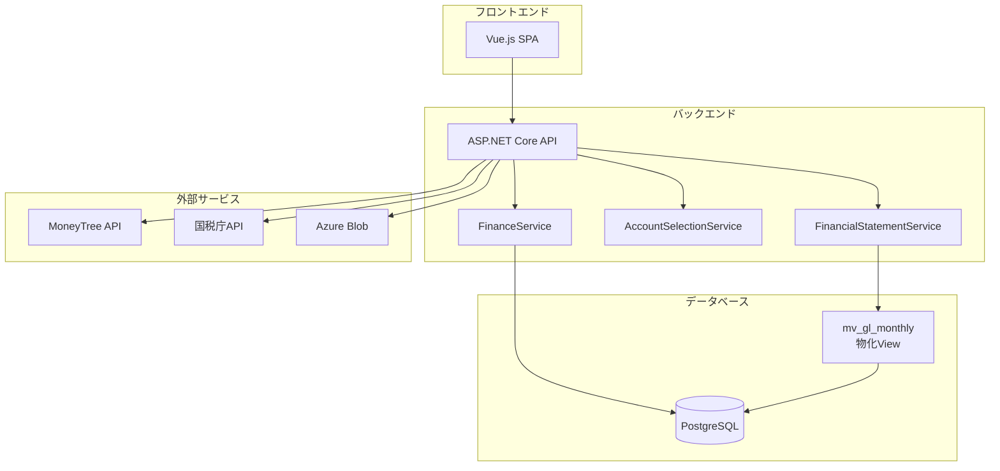
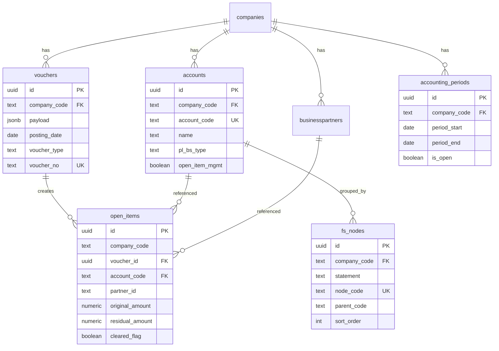
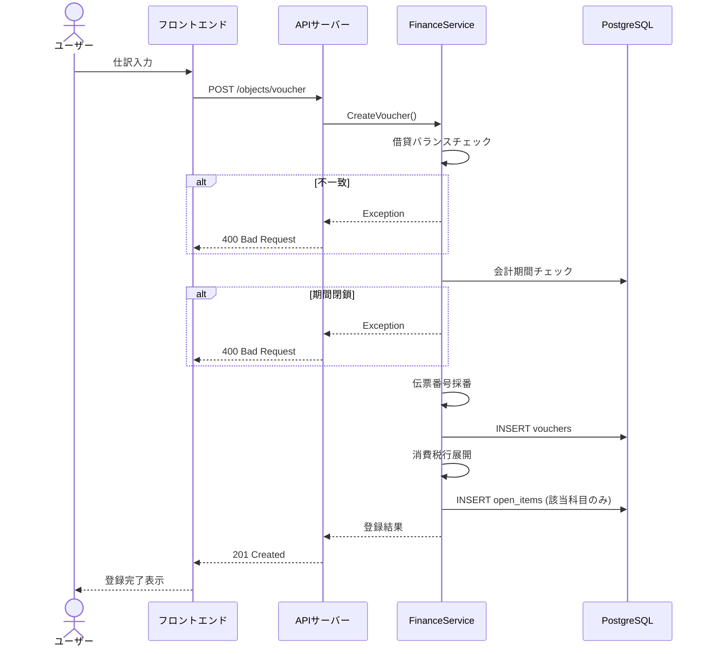
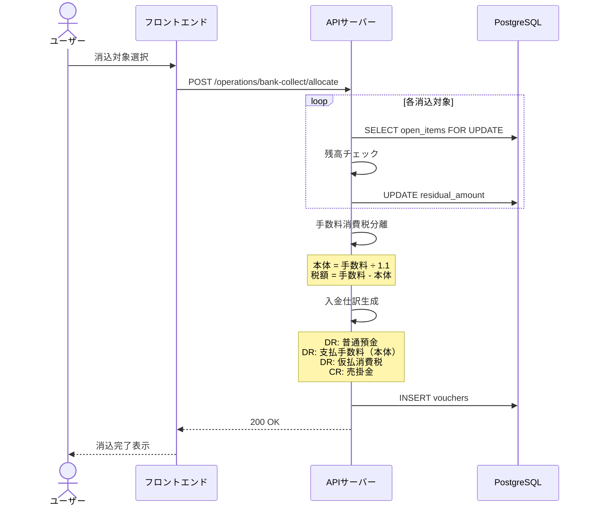
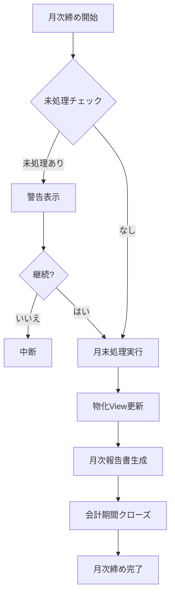
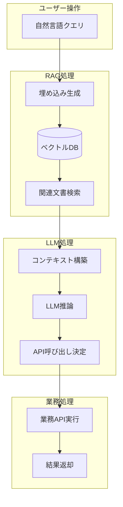

# 財務会計モジュール機能設計書

## 文書情報

| 項目 | 内容 |
|-----|-----|
| 文書名 | 財務会計モジュール機能設計書 |
| 版数 | 1.0 |
| 作成日 | 2025-01-XX |
| 対象システム | ERP統合システム |

---

## 1. 業務概要と背景

### 1.1 目的

本財務会計モジュールは、中小企業の日常経理業務をサポートし、以下の機能を提供することを目的とする：

- 日次の仕訳入力・管理
- 取引先（得意先・仕入先）管理
- 銀行入出金消込
- 財務諸表の作成
- インボイス制度への対応
- AIを活用した自動仕訳

### 1.2 対象ユーザー

| ロール | 利用機能 |
|-------|---------|
| 経理担当者 | 仕訳入力、消込処理、帳票出力 |
| 経理マネージャー | 期間締め、財務諸表確認、承認 |
| システム管理者 | 科目設定、ルール設定 |

### 1.3 業務フロー概要



---

## 2. システム構成

### 2.1 アーキテクチャ



### 2.2 技術スタック

| レイヤー | 技術 |
|---------|-----|
| フロントエンド | Vue.js 3 + Element Plus |
| バックエンド | ASP.NET Core 8 |
| データベース | PostgreSQL 15 |
| 認証 | JWT Bearer Token |
| ストレージ | Azure Blob Storage |

---

## 3. 機能一覧

### 3.1 機能マトリクス

| 機能ID | 機能名 | 画面 | API | 優先度 |
|--------|-------|:----:|:---:|:------:|
| FIN-001 | 科目マスタ管理 | ✓ | ✓ | 必須 |
| FIN-002 | 仕訳伝票入力 | ✓ | ✓ | 必須 |
| FIN-003 | 仕訳伝票編集・削除 | ✓ | ✓ | 必須 |
| FIN-004 | 会計期間管理 | ✓ | ✓ | 必須 |
| FIN-005 | 銀行入金消込 | ✓ | ✓ | 必須 |
| FIN-006 | 銀行出金消込 | ✓ | ✓ | 必須 |
| FIN-007 | 貸借対照表 | ✓ | ✓ | 必須 |
| FIN-008 | 損益計算書 | ✓ | ✓ | 必須 |
| FIN-009 | 勘定科目残高照会 | ✓ | ✓ | 必須 |
| FIN-010 | 勘定科目元帳 | ✓ | ✓ | 必須 |
| FIN-011 | インボイス番号検証 | ✓ | ✓ | 必須 |
| FIN-012 | 銀行明細取込 | ✓ | ✓ | 推奨 |
| FIN-013 | AI自動仕訳 | ✓ | ✓ | 推奨 |

### 3.2 画面一覧

| 画面ID | 画面名 | パス | 説明 |
|--------|-------|-----|-----|
| SCR-001 | 科目一覧 | /accounts | 科目マスタの一覧・検索 |
| SCR-002 | 科目編集 | /accounts/edit/:id | 科目の新規作成・編集 |
| SCR-003 | 仕訳一覧 | /vouchers | 仕訳伝票の一覧・検索 |
| SCR-004 | 仕訳詳細 | /vouchers/:id | 仕訳伝票の詳細・編集 |
| SCR-005 | 会計期間 | /accounting-periods | 会計期間の開閉管理 |
| SCR-006 | 銀行出金 | /bank-payment | 銀行出金消込処理 |
| SCR-007 | 財務諸表 | /financial/statements | BS/PL表示 |
| SCR-008 | 科目残高 | /account-balance | 科目別残高推移 |
| SCR-009 | 科目元帳 | /account-ledger | 科目別明細照会 |

---

## 4. データベース設計

### 4.1 ER図



### 4.2 主要テーブル定義

#### 4.2.1 仕訳伝票テーブル (vouchers)

| カラム名 | データ型 | 制約 | 説明 |
|---------|---------|-----|------|
| id | UUID | PK | 主キー |
| company_code | TEXT | NOT NULL | 会社コード |
| payload | JSONB | NOT NULL | 仕訳データ本体 |
| posting_date | DATE | GEN | 転記日（生成列） |
| voucher_type | TEXT | GEN | 伝票種別（生成列） |
| voucher_no | TEXT | GEN, UK | 伝票番号（生成列） |
| created_at | TIMESTAMPTZ | DEFAULT NOW() | 作成日時 |
| updated_at | TIMESTAMPTZ | DEFAULT NOW() | 更新日時 |

**payload構造:**

```json
{
  "header": {
    "companyCode": "JP01",
    "voucherNo": "2501000001",
    "postingDate": "2025-01-15",
    "voucherType": "GL",
    "currency": "JPY",
    "summary": "摘要テキスト",
    "invoiceRegistrationNo": "T1234567890123",
    "invoiceRegistrationStatus": "valid",
    "createdBy": "user@example.com",
    "createdAt": "2025-01-15T10:00:00Z"
  },
  "lines": [
    {
      "lineNo": 1,
      "accountCode": "1000",
      "drcr": "DR",
      "amount": 10000,
      "vendorId": "V001",
      "note": "明細備考"
    }
  ]
}
```

#### 4.2.2 科目マスタテーブル (accounts)

| カラム名 | データ型 | 制約 | 説明 |
|---------|---------|-----|------|
| id | UUID | PK | 主キー |
| company_code | TEXT | NOT NULL | 会社コード |
| payload | JSONB | NOT NULL | 科目データ本体 |
| account_code | TEXT | GEN, UK | 科目コード（生成列） |
| name | TEXT | GEN | 科目名（生成列） |
| pl_bs_type | TEXT | GEN | BS/PL区分（生成列） |
| open_item_mgmt | BOOLEAN | GEN | 未消込管理（生成列） |
| fs_bs_group | TEXT | GEN | BS表示グループ（生成列） |
| fs_pl_group | TEXT | GEN | PL表示グループ（生成列） |

**payload構造:**

```json
{
  "code": "1100",
  "name": "普通預金",
  "category": "BS",
  "openItem": false,
  "isBank": true,
  "bankInfo": {
    "bankName": "みずほ銀行",
    "branchName": "本店",
    "accountType": "普通",
    "accountNo": "1234567",
    "holder": "株式会社サンプル",
    "currency": "JPY"
  },
  "fieldRules": {
    "customerId": "hidden",
    "vendorId": "hidden"
  },
  "fsBalanceGroup": "BS_ASSET_CURRENT"
}
```

#### 4.2.3 未消込項目テーブル (open_items)

| カラム名 | データ型 | 制約 | 説明 |
|---------|---------|-----|------|
| id | UUID | PK | 主キー |
| company_code | TEXT | NOT NULL | 会社コード |
| voucher_id | UUID | FK | 元仕訳ID |
| voucher_line_no | INT | | 仕訳明細行番号 |
| account_code | TEXT | NOT NULL | 科目コード |
| partner_id | TEXT | | 取引先ID |
| currency | TEXT | DEFAULT 'JPY' | 通貨 |
| doc_date | DATE | | 伝票日付 |
| original_amount | NUMERIC(18,2) | | 元金額 |
| residual_amount | NUMERIC(18,2) | | 残高 |
| cleared_flag | BOOLEAN | DEFAULT FALSE | 消込済フラグ |
| cleared_at | TIMESTAMPTZ | | 消込日時 |

---

## 5. API仕様

### 5.1 API一覧

| メソッド | パス | 説明 | 認証 |
|---------|-----|------|:----:|
| POST | /objects/voucher | 仕訳作成 | ✓ |
| PUT | /vouchers/{id} | 仕訳更新 | ✓ |
| DELETE | /objects/voucher/{id} | 仕訳削除 | ✓ |
| POST | /objects/account | 科目作成 | ✓ |
| PUT | /objects/account/{id} | 科目更新 | ✓ |
| GET | /objects/account/{code}/references | 科目参照確認 | ✓ |
| POST | /operations/bank-collect/allocate | 銀行入金消込 | ✓ |
| POST | /operations/bank-payment/allocate | 銀行出金消込 | ✓ |
| GET | /reports/financial/balance-sheet | 貸借対照表 | ✓ |
| GET | /reports/financial/income-statement | 損益計算書 | ✓ |
| POST | /reports/account-balance | 科目残高照会 | ✓ |
| POST | /reports/account-ledger | 科目元帳照会 | ✓ |

### 5.2 API詳細

#### 5.2.1 仕訳作成 API

**エンドポイント:** `POST /objects/voucher`

**リクエストヘッダー:**
| ヘッダー | 必須 | 説明 |
|---------|:---:|------|
| Authorization | ✓ | Bearer {token} |
| x-company-code | ✓ | 会社コード |

**リクエストボディ:**
```json
{
  "payload": {
    "header": {
      "postingDate": "2025-01-15",
      "voucherType": "GL",
      "currency": "JPY",
      "summary": "取引摘要"
    },
    "lines": [
      {
        "accountCode": "1000",
        "drcr": "DR",
        "amount": 10000
      },
      {
        "accountCode": "4100",
        "drcr": "CR",
        "amount": 10000
      }
    ]
  }
}
```

**レスポンス (201 Created):**
```json
{
  "id": "550e8400-e29b-41d4-a716-446655440000",
  "company_code": "JP01",
  "voucher_no": "2501000001",
  "posting_date": "2025-01-15",
  "payload": { ... }
}
```

**エラーレスポンス:**
| ステータス | エラー | 説明 |
|-----------|-------|------|
| 400 | Voucher not balanced | 借貸不一致 |
| 400 | 対象の会計期間は閉鎖されています | 期間締め済み |
| 403 | forbidden | 権限不足 |

#### 5.2.2 銀行出金消込 API

**エンドポイント:** `POST /operations/bank-payment/allocate`

**リクエストボディ:**
```json
{
  "header": {
    "postingDate": "2025-01-15",
    "bankAccountCode": "1100",
    "currency": "JPY",
    "bankFeeAmount": 550,
    "bankFeeAccountCode": "6500"
  },
  "allocations": [
    {
      "openItemId": "550e8400-e29b-41d4-a716-446655440000",
      "applyAmount": 100000
    }
  ]
}
```

**処理ロジック:**
1. 各open_itemの残高チェック
2. 残高更新（residual_amount減算）
3. 消込済フラグ更新
4. 振込手数料の消費税分離（税率10%）
   - 本体金額: bankFeeAmount ÷ 1.1（四捨五入）
   - 消費税: bankFeeAmount - 本体金額
5. 仕訳伝票作成:
   - DR: 買掛金（消込金額）
   - DR: 支払手数料（本体）
   - DR: 仮払消費税（税額）
   - CR: 普通預金（合計）

**レスポンス:**
```json
{
  "amount": 100550,
  "clearingAmount": 100000,
  "feeAmount": 550,
  "voucherNo": "2501000002"
}
```

---

## 6. 処理フロー

### 6.1 仕訳登録フロー



### 6.2 銀行入金消込フロー



### 6.3 月次締めフロー（推奨実装）



---

## 7. AI連携設計

### 7.1 概要

本モジュールはAIとの連携により、以下の機能を提供する：

| 機能 | 説明 | 連携方式 |
|-----|------|---------|
| 画像から仕訳 | 領収書画像から仕訳生成 | Vision API |
| 自動科目選定 | 摘要から科目推定 | RAG |
| 銀行明細仕訳 | 銀行取引から仕訳生成 | ルール+AI |

### 7.2 RAG連携設計



### 7.3 Claude Skills対応

本設計書をAI（Claude）に理解させることで、ユーザーは自然言語で以下の操作が可能となる：

**対話例:**

```
User: 「今日の日付で、普通預金から30万円を仕入先Aに振り込んだ仕訳を作って」

AI分析:
- 意図: 仕訳作成
- 転記日: 今日
- 取引: 銀行振込（出金）
- 金額: 300,000円
- 相手先: 仕入先A

AI実行:
1. 仕入先AのpartnerCodeを検索
2. 仕入先Aの未消込項目（買掛金）を検索
3. /operations/bank-payment/allocate を呼び出し
4. 結果をユーザーに報告
```

**AIが理解すべき概念:**

| 概念 | 説明 | 関連API |
|-----|------|---------|
| 仕訳 | 複式記帳の取引記録 | /objects/voucher |
| 消込 | 未清算項目の精算 | /operations/bank-*/allocate |
| 科目 | 勘定科目マスタ | /objects/account |
| 期間 | 会計期間の開閉 | /objects/accounting_period |
| 財務諸表 | BS/PL報告書 | /reports/financial/* |

---

## 8. 非機能要件

### 8.1 性能要件

| 項目 | 要件 |
|-----|-----|
| 仕訳登録応答時間 | 3秒以内 |
| 一覧表示応答時間 | 5秒以内 |
| 財務諸表生成時間 | 10秒以内 |
| 同時接続ユーザー数 | 50ユーザー |

### 8.2 セキュリティ要件

| 項目 | 対応 |
|-----|-----|
| 認証 | JWT Bearer Token |
| 認可 | ロールベース（Capability） |
| データ分離 | company_codeによるテナント分離 |
| 監査ログ | 作成者・更新者の記録 |

### 8.3 可用性要件

| 項目 | 要件 |
|-----|-----|
| 稼働率 | 99.5%以上 |
| バックアップ | 日次 |
| 障害復旧時間 | 4時間以内 |

---

## 9. 用語集

| 用語 | 説明 |
|-----|------|
| 仕訳 | 複式簿記における取引の記録単位 |
| 消込 | 売掛金・買掛金等の未清算項目を精算すること |
| 未消込項目 | open_items テーブルで管理される未清算残高 |
| インボイス | 適格請求書。登録番号の検証が必要 |
| 物化View | mv_gl_monthly。月次集計を高速化するためのキャッシュ |
| 転記日 | posting_date。仕訳の会計上の日付 |
| 伝票番号 | voucher_no。yymm+6桁連番で自動採番 |

---

## 改訂履歴

| 版数 | 日付 | 変更内容 | 担当者 |
|-----|------|---------|-------|
| 1.0 | 2025-01-XX | 初版作成 | - |

